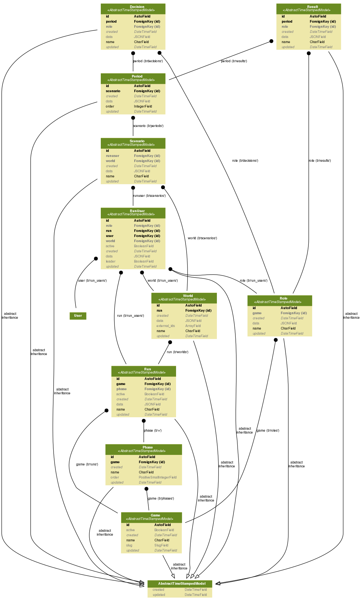

# Simpl Games Framework API Project

[](https://travis-ci.com/simplworld/simpl-games-api)

This project requires PostgreSQL 9+ and uses Python 3.7.x and Django 2.2.x

## Getting Started With Docker

Using docker is the easiest way to get started with Simpl.  All you need to do is clone
this repo and run `docker-compose up` to get the API up and running on your local
system.

After you have the containers up you will need to setup a superuser and staff user
to allow your Simpl model processes to connect and for you to use the Django admin
to inspect the data.

To help set things up you can just get a shell into the container and run `./manage.py create_simpl_user`,
here are the steps:

```bash
$ make shell
$ ./manage.py create_simpl_user
```

`make shell` is just a little helper that run `docker-compose run --rm api bash` for you.

## Getting Started Without Docker

### Setup simpl-games-api

```bash
$ git clone git@github.com:simplworld/simpl-games-api.git
$ cd simpl-games-api
$ mkvirtualenv simpl-games-api
$ add2virtualenv .
$ pip install -r requirements.txt
```

### Create PostgreSQL database

Create a database:

```bash
$ createdb simpl
```

### Database Setup

Sync models to database:

```bash
$ ./manage.py migrate
```

### Create a superuser for testing

Create a superuser account to access the admin:

```bash
$ ./manage.py createsuperuser
```

For local development, run:

```bash
$ ./manage.py create_simpl_user
```

This creates a super user with id 'simpl@simpl.world' and password 'simpl' and ensures test users can be assigned passwords in scripts.

### Settings setup

Setup the `DJANGO_SETTINGS_MODULE` to use:

```bash
$ export DJANGO_SETTINGS_MODULE=config.settings.local
```

For local development running outside docker, use:

```bash
$ export SIMPL_WEBHOOK_ALLOW_LOCALHOST=True
$ export SIMPL_WEBHOOK_ALLOW_HTTP=True
```

### Start the web server

```bash
$ ./manage.py runserver 0.0.0.0:8100
```
**NOTE**: You may need to create a directory named `staticfiles` and run `manage.py collectstatic` to have the admin media show up correctly.

Django's `runserver` does not support `Keep-Alive` requests, so we use `gunicorn` instead in production.

A command to run gunicorn is included in `simpl-games-api`:

```bash
$ ./manage.py run_gunicorn
```


### Run tests

Run `py.test`:

```bash
$ export DJANGO_SETTINGS_MODULE=config.settings.test
$ py.test
```

Do not commit code if tests are failing.

## Release

To release a new version of the docker image, tag a new version with `bumpversion`:

```
$ bumpversion patch
```

Then push to the repo:

```
$ git push && git push --tags
```


## Generate updated ERD of Models

If you are using an environment that supports running Pillow, uncomment the Pillow line in requirements.txt and run:

```
$ pip install -r requirements.txt --upgrade
$ ./manage.py graph_models games -o docs/models.png
```


## Model Schema



## Check Deployed System

We have a simple management command which will check DNS, HTTP/HTTPS connectivity in general, ability to login to the admin, that the API responds properly and that the game slug in question is installed.  To use this command you **MUST** have a valid admin login to use the command.

Simple usage:

```
manage.py check_deploy https://simpl.mine.ed/
```

The command will prompt you for your admin user's email address (aka username), password, and game slug.  Or you can provide them on the command line like this:

```
manage.py check_deploy https://simpl.mine.ed/ --email='me@mine.ed' --password='sumpun' --game=sim
```

## Count game model objects

Management command that print counts of all simpl model objects based on game slug. For example, run

```
./manage.py count_game_models -s calc
```

to see counts of all model objects for a game with slug 'calc'.


## What's where?

- [API Docs](http://localhost:8100/)
- [Simpl apis](http://localhost:8100/apis/)
- [Django Admin](http://localhost:8100/admin/)

Copyright © 2018 The Wharton School,  The University of Pennsylvania 

This program is free software; you can redistribute it and/or
modify it under the terms of the GNU General Public License
as published by the Free Software Foundation; either version 2
of the License, or (at your option) any later version.

This program is distributed in the hope that it will be useful,
but WITHOUT ANY WARRANTY; without even the implied warranty of
MERCHANTABILITY or FITNESS FOR A PARTICULAR PURPOSE.  See the
GNU General Public License for more details.

